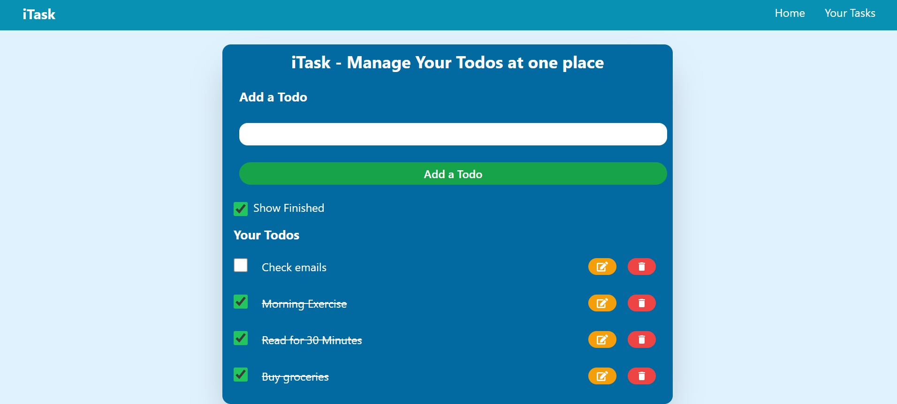

# 📝 iTask - Todo App

A modern and responsive Todo App built using React, Vite and Tailwind CSS.

## 🚀 Live Demo

👉 https://YOUR-VERCEL-LINK.vercel.app

## ✨ Features

- ✅ Add new todos
- ✏️ Edit existing todos
- 🗑️ Delete todos with confirmation
- ⌨️ Press Enter to add/update tasks
- ✔️ Mark tasks as completed
- 👀 Show/Hide completed tasks
- 💾 Local Storage support
- 📱 Responsive design

## 🛠️ Tech Stack

- React
- Vite
- Tailwind CSS
- JavaScript
- HTML
- CSS

## 📸 Screenshot



## 📂 Installation

```bash
git clone https://github.com/YOUR_USERNAME/Todo-App.git
cd Todo-App
npm install
npm run dev
```

## 👨‍💻 Author

**Nikhil Deep Prasad**
